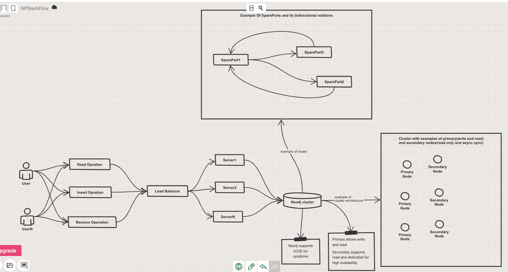

#Task1

### Prerequisites
java 8 or higher

### How to run
* Navigate to source code `cd src/main/java/`
* Compile class `javac DomainCounter.java`
* Run the class by passing the file with domain names `java DomainCounter ../../test/resources/domains.txt`
  * File can be taken from `src/test/resources/`

### Notes
* Maven was added to have tests and check the validity of the application
* No packages to simplify navigation during the run from the terminal
* The algorithm can be refined by applying a producer-consumer pattern in case we have big files
* For production use, it might be necessary to consider map-reduce pattern
* I would add performance tests using huge files with many records and analyze execution time

#Task2

### Modeling
* Firstly, we are going to emphasize the importance of bidirectional relations.
* The modeling will be presented by using Java classes that can be used in the future with some object mapper and potential database

```java
// 
class SparePart {
  // should be the primary key and indexed; equals and hashCode will consider this field
  String serialNumber;
  String name;
  String manufacturer;
  int weight;
  // ti will be bidirectional relations. An example of usage will be shown below
  Set<SparePart> compatible parts;
  
  //...constructors, getters, setters, equals and hashCode
} 

class Main {
  // Presenting how we are going to use bidirectional relation
  public static void main(String[] args) {
    SparePart sparePart1 = new SparePart("1", "Wheel 18'", 25, "Scorpion");
    SparePart sparePart2 = new SparePart("2", "Tire 18'", 15, "Scorpion");
    //It is needed in order to find all the entities that reference a potential removable entity
    // then update them respectively
    sparePart1.getCompatibleParts().add(sparePart2);
    sparePart2.getCompatibleParts().add(sparePart1);
    //Such bidirectional relations can be implemented in different DB (SQL, NoSQL)
  }
}
```

### Performance tips
* Soft Removing
  * Mark entity as removed without an actual removal. In this case, reindexing will not affect the performance
* Index field that can be participated in a search operation.
* Background jobs can help while reindexing.
  * Background job for removing inactive times to not affect on real customers
  * Also, it can be used during Compatibility Updates
* Conflict Resolution: Handle situations when multiple users try to add or remove parts simultaneously.
  * In this case, we should consider Atomicity and kind of Isolation. Usually it is covered by some DB engine

### Choosing DB
* Understanding CAP theorem of a particular DB to consider business needs
  * AP or CP.
  * We should understand what is a priority for us
    * Consistency and Partition Tolerance
    * Availability and Partition Tolerance
* NoSQL
  * Some graph db will be a good candidate since there is relations-based operations. Most of business logic is based on that
  * Example of graph db is Neo4J
  * The strength of NoSQL databases is horizontal scalability

### Sketch of simplified architecture with Neo4J

[Link to architecture](https://sketchboard.me/pBSktWkrcdFY#/)

### Questions
* What is the expected load?
  * How many users should the application support?
  * How many inserts and deletes will be expected during the peaks?
* How many items are we going to keep and process? (Capacity Planning)
* What is the desired TPS(Transaction Per Second) for our application?
* Discuss availability zones if our business is cross-continental
* Get metrics(TPS and Latency) by conducting a real performance testing

### Conclusions
As we see, many business questions have an impact on decisions regarding modeling and tuning of operations over DB.
So far, it seems that Graph Database's ability to scale horizontally will cover our needs.
Although, the final word should be made after performance testing.
